# Pengantar Web Mining — Slide Ringkas

> Dikonversi otomatis dari `lectures/01. Pengantar Web Mining.ppt`.
> Total 30 slide. Untuk detail aslinya baca file sumber .ppt.

## Slide 1: Pencarian dan Penambangan Web

**Isi slide:**

- Pencarian dan Penambangan Web
- Pengantar Web Mining
- Mulaab M
Prodi Teknik Informatika
Universitas Trunojoyo Madura
2026

## Slide 2: 1.Punya repositori Web mining
Dengan github.com/yourusername/ppw
2. Webstatis :Isinya
1. Profile anda
Nama :
NPM
Email  :
2. Pengantar web mining

**Isi slide:**

- 1.Punya repositori Web mining
Dengan github.com/yourusername/ppw
2. Webstatis :Isinya
1. Profile anda
Nama :
NPM
Email  :
2. Pengantar web mining

## Slide 3: Membuat repositori github dengan nama repository : ppw
Gihub.com/<user>/ppw
Masuk jam 9.40 ( terlambat dilarang masuk !!!)
Membawa laptop ( tidak membawa laptop dilarang masuk )
Tidak hadir 20% D (maximal 3 pertemuan)
Gihub.com/your username/ppw

**Isi slide:**

- Membuat repositori github dengan nama repository : ppw
Gihub.com/<user>/ppw
Masuk jam 9.40 ( terlambat dilarang masuk !!!)
Membawa laptop ( tidak membawa laptop dilarang masuk )
Tidak hadir 20% D (maximal 3 pertemuan)
Gihub.com/your username/ppw

## Slide 4: Pengantar

**Isi slide:**

- Pengantar
- Kuliah ini memperkenalkan konsep dasar dan teknologi dari web mining.
Topik terdiri
Pengantar Web Mining
Web Crawling
Web Data Preprocessing
Pembelajaran Terawasi (Supervised Learning)
Pembelajaran Tak terawasi (Unsupervised Learning)
Web Content Mining ( text mining)
Web Usage Mining
Web structure Mining (graph mining)
Deployment System

## Slide 5: Tujuan

**Isi slide:**

- Tujuan
- Mahasiswa akan dapat memahami dan menggunakan konsep dasar dan teknologi web mining.
Mahasiwa akan dapat melakukan penelitian sistem informasi dalam konteks web mining.

## Slide 6: Web Mining

**Isi slide:**

- Web Mining
- Penambangan web adalah proses menemukan dan mengekstrak informasi dari internet menggunakan berbagai teknik penambangan data. Informasi ini dapat digunakan oleh perusahaan untuk pengambilan keputusan yang efektif.

## Slide 7: Definisi

**Isi slide:**

- Definisi
- Penambangan web adalah penggunaan teknik penambangan data untuk secara otomatis menemukan dan mengekstrak informasi dari layanan web" (Etzioni, 1996; CACM 39).
Penambangan web bertujuan untuk menemukan pola-pola berguna atau  pengetahuan dari struktur hiperlink web, isi halaman web, serta perilaku pengguna." (Bing Liu, 2007, Web Data Mining).

## Slide 8: Tantangan pemrosesan data Web

**Isi slide:**

- Tantangan pemrosesan data Web
- Web adalah pangkalan data yang sangat besar
Datanya dalam format HTML, XML, text
Tantangan pemrosesan data Web)
Web adalah sangat besar untuk dilakukan penambangan data
Web sangat komplek
Web sangat dinamis
Web bukan domain yang spesifik
Web adalah segalanya
- Source:  Turban et al. (2011), Decision Support and Business Intelligence Systems

## Slide 9: Taxonomy Web Mining

**Isi slide:**

- Taxonomy Web Mining
- 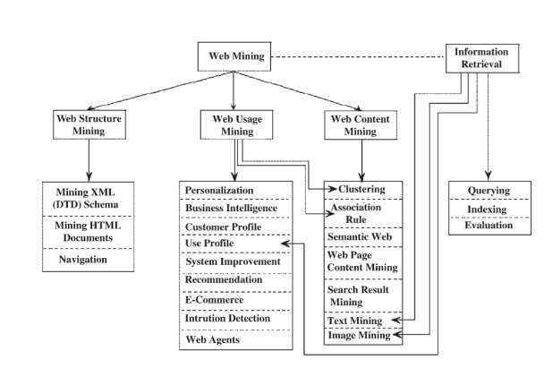

## Slide 10: Penambangan Isi Web (Content Mining)

**Isi slide:**

- Penambangan Isi Web (Content Mining)
- Proses mengekstrak informasi berguna dari dokumen-dokumen web.
Fokus pada konten halaman web seperti:
Teks (Text Mining)->Artikel, deskripsi, komentar
Gambar (Image Mining) -> Foto, ilustrasi
Audio (Audio Mining)-> Rekaman Suara, Musik
Video (Video Mining)-> Streaming clip
Data terstruktur (tabel, daftar)-> tabel deskripsi
- Source:  Turban et al. (2011), Decision Support and Business Intelligence Systems

## Slide 11: Aplikasi Text Mining

**Isi slide:**

- Aplikasi Text Mining
- Extraksi Informasi
Topic modelling
Peringkasan dokumen
Klasifikasi dokumen ( sentiment analisis, opinion mining)
Pengelompokan dokumen ( Sistem Rekomendasi)
Ektraksi kata kunci
- Source:  Turban et al. (2011), Decision Support and Business Intelligence Systems

## Slide 12: Klasifikasi Dokumen (Content Mining)

**Isi slide:**

- Klasifikasi Dokumen (Content Mining)
- Tujuan: Dokumen atau gambar yang sebelumnya belum pernah dilihat harus dikategorikan ke dalam kelas dengan seakurat mungkin.
Aplikasi
Kategorisasi berita
Kategorisasi produk
Deteksi spam
Metode klasifikasi : Naive Bayes, Support Vector Machines), Jaringan Saraf Tiruean (Mendalam) (Deep Neural Nets), Transformers

## Slide 13: Pengelompokan Konten (Content Clustering)

**Isi slide:**

- Pengelompokan Konten (Content Clustering)
- Diberikan himpunan dokumen dan ukuran kesamaan antar dokumen, cari kelompok (cluster) sehingga:
Dokumen dalam satu kelompok lebih mirip satu sama lain
Dokumen dalam kelompok yang berbeda kurang mirip satu sama lain
Aplikasi
Pengelompokan hasil pencarian (search result clustering)
Penemuan topik (topic discovery)
Teknik yang Digunakan
Algoritma: K-Means, Pengelompokan Hierarkis (Hierarchical Clustering), S-BERT
Ukuran kesamaan (Similarity measures): Cosine, Jaccard, Kesamaan Embbeding (Similarity of Embeddings)

## Slide 14: Analisa Sentimen

**Isi slide:**

- Analisa Sentimen
- Tugas dasar dalam analisis sentimen adalah mengklasifikasikan polaritas teks yang diberikan pada tingkat dokumen, kalimat, atau fitur/atribut.
Nilai Polaritas (Positif, Netral, Negatif)
Aplikasi :
Prediksi suara (vote) dari tweet (contoh: pendapat publik terhadap isu politik)
Analisis ulasan produk (contoh: menilai apakah pelanggan puas dengan kualitas layanan, desain, atau harga)

## Slide 15: 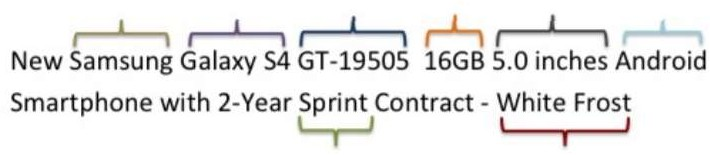

**Isi slide:**

- 
- Contoh
- Brand	Model	Type	Memory	Screen	OS
- Kesulitan dari ektraksi informasi yang kurang terstruktur
- Ektraksi Informasi
- Tujuan: Pengambilan informasi terstruktur secara otomatis dari konten web yang tidak terstruktur atau Semi-structured dari isi web
- 
- 
- Difficulty of information extraction
- Web APIs
- HTML-embedded Data
HTML Tables
DOM Trees
Free text
- Parsers
- LLMs
- Universität Mannheim – Bizer/Ponzetto/Peeters/Takeshita: Web Mining – FSS2025 (Version: 10.2.2025) – Slide

## Slide 16: Web Usage Mining

**Isi slide:**

- Web Usage Mining
- Ekstraksi informasi dari data yang dihasilkan melalui kunjungan halaman web dan transaksI
Data yang disimpan dalam log akses server, log referer, log agen, dan cookie sisi klien
Karakteristik pengguna dan profil penggunaan
Metadata, seperti atribut halaman, atribut konten, dan data penggunaan
Data clickstream ->Catatan urutan klik pengguna saat menjelajahi situs web.
Analisis clickstream -> Proses menganalisis pola perilaku pengguna
- Source:  Turban et al. (2011), Decision Support and Business Intelligence Systems

## Slide 17: Web Usage Mining(clickstream analysis)

**Isi slide:**

- Web Usage Mining(clickstream analysis)
- 
- Source:  Turban et al. (2011), Decision Support and Business Intelligence Systems

## Slide 18: Proses dari Web Usage Mining

**Isi slide:**

- Proses dari Web Usage Mining
- 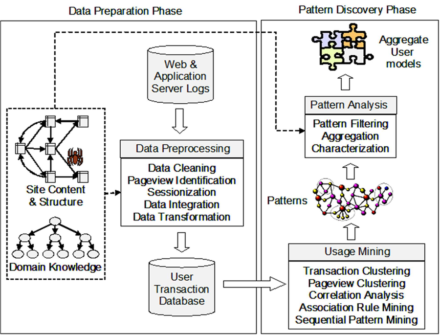

## Slide 19: Aplikasi dari Web Usage Mining

**Isi slide:**

- Aplikasi dari Web Usage Mining
- Product Recommendation: sistem atau fitur yang memprediksi dan menyarankan produk yang paling mungkin diminati oleh seorang pengguna, berdasarkan data seperti perilaku, preferensi, atau kesamaan dengan pengguna lain.
Personalized Search (Pencarian yang Dipersonalisasi): pendekatan dalam pencarian informasi di mana hasil pencarian disesuaikan dengan preferensi, perilaku, dan konteks pengguna individu.

## Slide 20: Penambangan Struktur Web (Web Structure Mining)

**Isi slide:**

- Penambangan Struktur Web (Web Structure Mining)
- Penemuan dan interpretasi pola dalam:
Struktur tautan (hyperlink) di internet
Hubungan sosial antar pelaku (aktor) yang berinteraksi di web
Sumber Graph Web
Pencarian web (web crawls) termasuk halaman HTML dan tautan (hyperlinks)
Jaringan sosial yang mencakup hubungan eksplisit antar pengguna(contoh: jaringan teman di Facebook)
Jenis data komunitas lainnya(forum diskusi, percakapan email, dll.)

## Slide 21: Aplikasi Web Struktur Mining

**Isi slide:**

- Aplikasi Web Struktur Mining
- Grafik Web (Web Graph): Representasi visual dari halaman web sebagai simpul (node) dan hyperlink sebagai sisi (edge).
Analisis struktur web digunakan untuk:
Menentukan otoritas halaman (seperti PageRank)
Mendeteksi komunitas online
Menganalisis jaringan sosial digital

## Slide 22: Identifikasi Simpul Penting

**Isi slide:**

- Identifikasi Simpul Penting
- 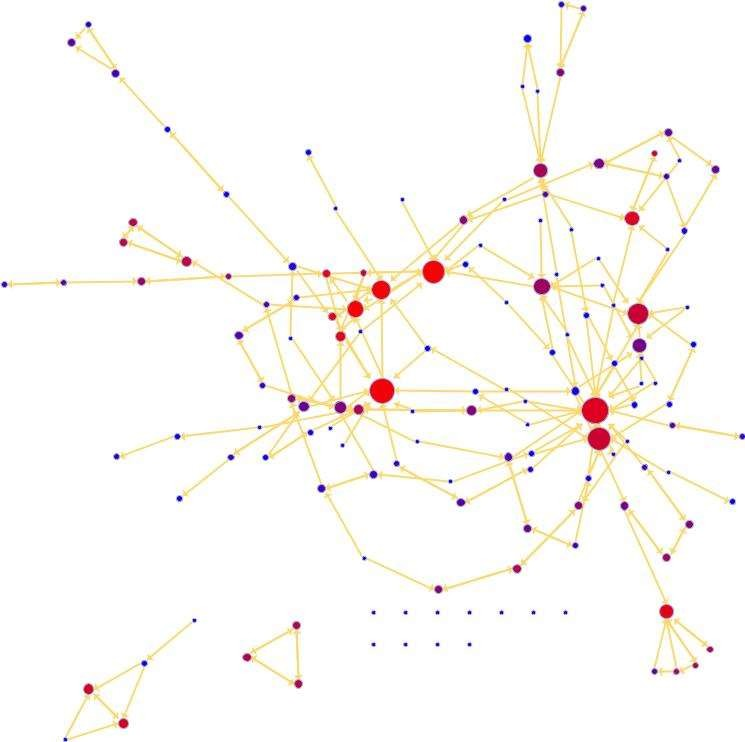
- ?
- ?
- ?
- Centrality
Mencari halaman penting (seperti situs berita utama)
Mengidentifikasi pengguna influencer di media sosial
Mendeteksi sumber informasi terpercaya
- 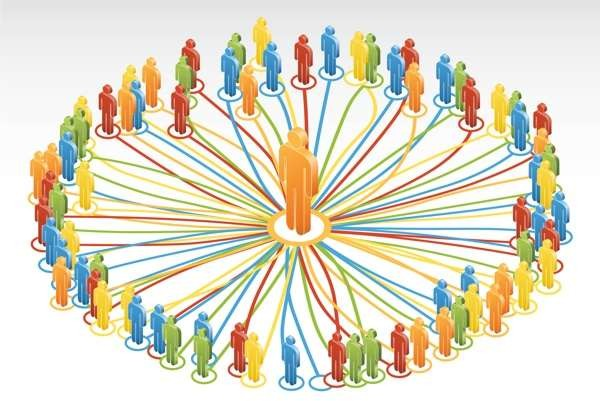
- Pertanyaan : Siapa aktor penting dalam jaringan sosial
- Universität Mannheim – Bizer/Ponzetto/Peeters/Takeshita: Web Mining – FSS2025 (Version: 10.2.2025) – Slide

## Slide 23: Implementasi

**Isi slide:**

- Implementasi
- Google Search: Menggunakan PageRank untuk menentukan urutan hasil pencarian.
Twitter/Instagram: Menampilkan akun influencer pada rekomendasi.
Analisis Jaringan Sosial: Mencari pemimpin komunitas atau penyebar berita palsu.

## Slide 24: Deteksi Komunitas

**Isi slide:**

- Deteksi Komunitas
- Menemukan komunitas dalam jaringan sosial berarti mengidentifikasi himpunan simpul (node) yang berinteraksi satu sama lain lebih sering dibandingkan dengan simpul-simpul di luar kelompok tersebut.
- Metode: Components, K-Cores
Aplkasi : Rekomendasi system berbasis komunitas, visualisasi jaringan
- Sebuah komunitas adalah himpunan aktor di antara mereka terjadi interaksi yang (relatif) sering.
- 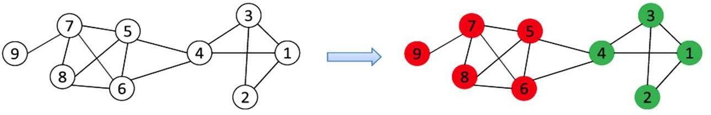
- 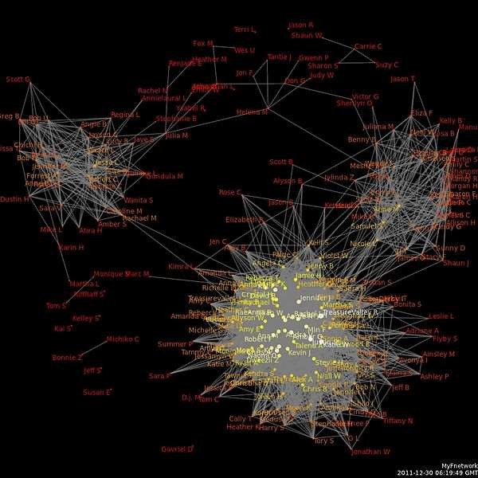

## Slide 25: Web Mining Kumpulan beberapa bidang ilmu

**Isi slide:**

- Web Mining Kumpulan beberapa bidang ilmu
- 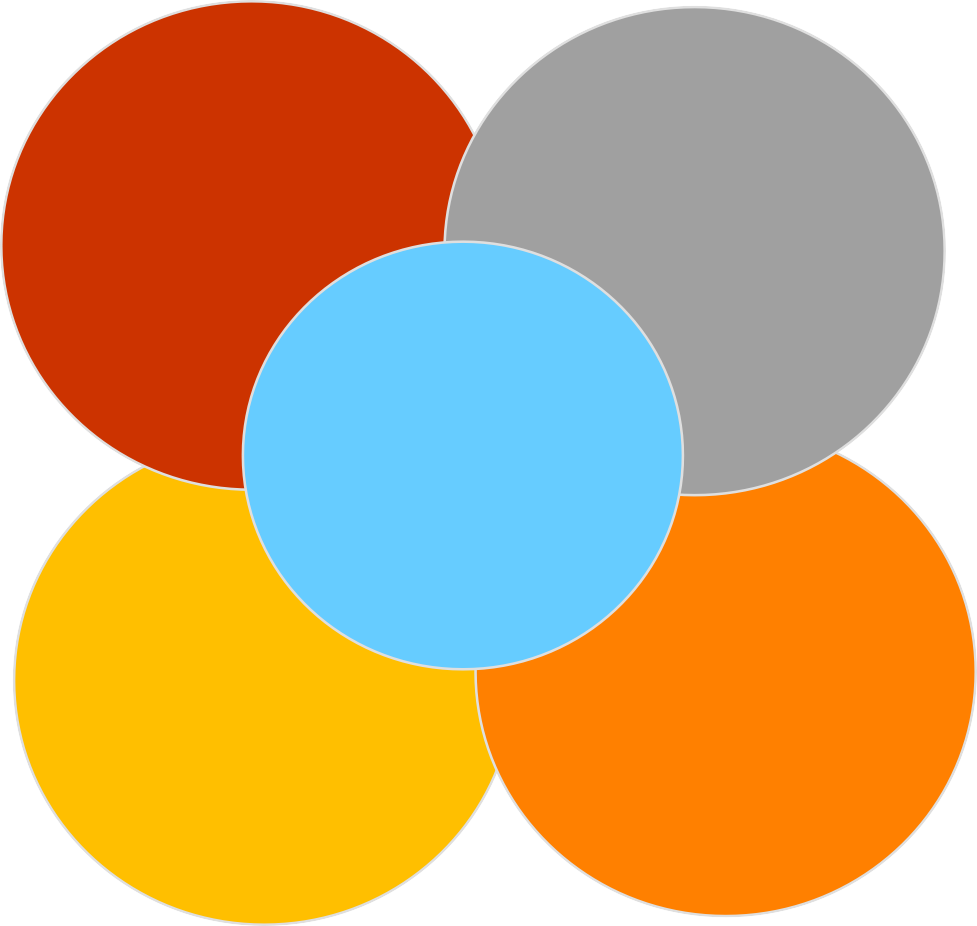
- Natural Language Processing
- Universität Mannheim – Bizer/Ponzetto/Peeters/Takeshita: Web Mining – FSS2025 (Version: 10.2.2025) – Slide
- Machine Learning
- Web Mining
- Database Systems
- Social Network Analysis
Graph mining
- Subbidang
Web Usage Mining
Web Structure Mining
Web Content Mining

## Slide 26: Proses Web Mining

**Isi slide:**

- Proses Web Mining
- Sama dengan proses data mining yang berbeda adalah tahapan pengumpulan data dan pemroesan data
- 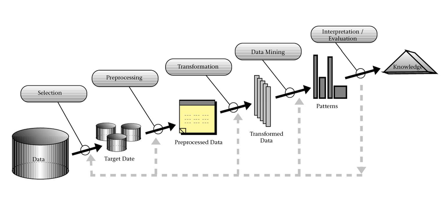
- 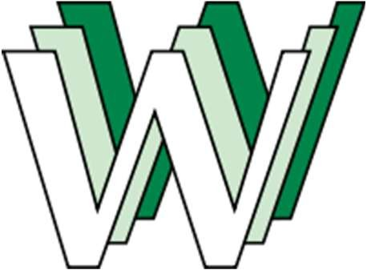
- Gathered
- 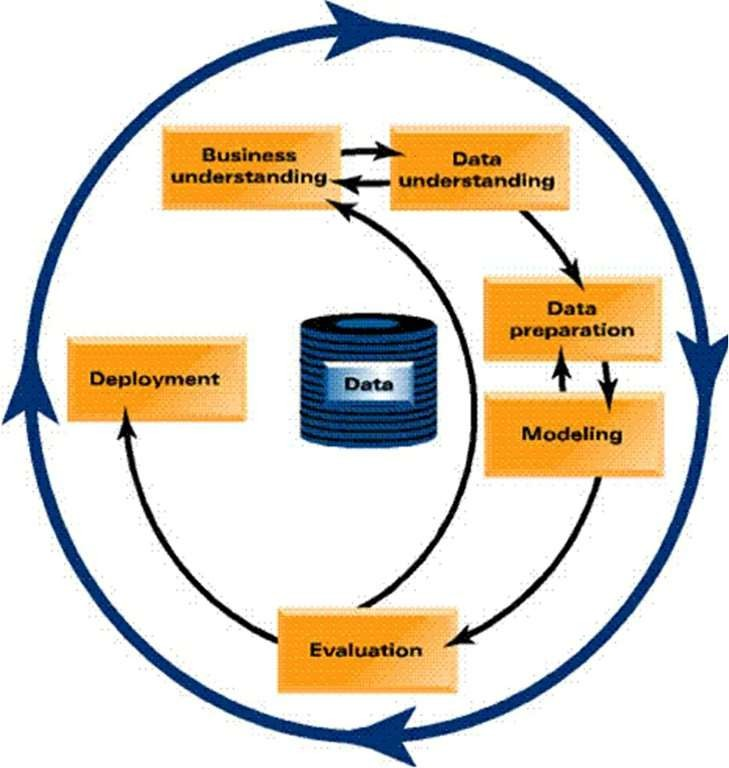

## Slide 27: Gathering and Exploration

**Isi slide:**

- Gathering and Exploration
- Pengumpulan data Web
Crawling dokumen atau data
Pengambilan data menggunakan Web API
Ekplorasi data
Memahami data
Ringkasan statistic data web
Visualasisasi data
- 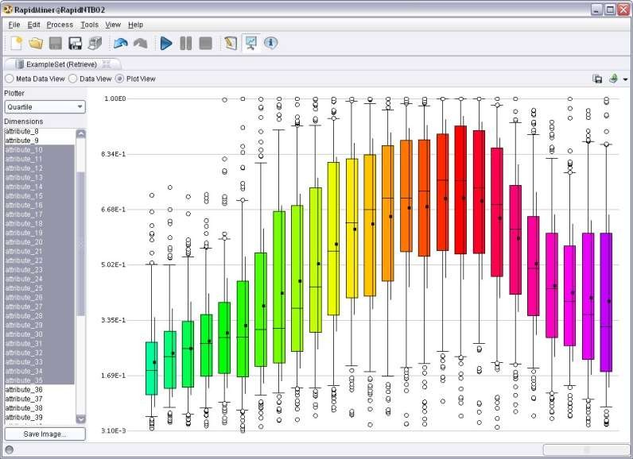
- 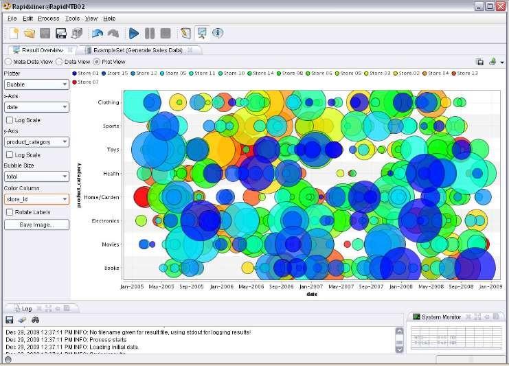
- Universität Mannheim – Bizer/Ponzetto/Peeters/Takeshita: Web Mining – FSS2025 (Version: 10.2.2025) – Slide

## Slide 28: Preprocessing and Transformation

**Isi slide:**

- Preprocessing and Transformation
- Mentransformasi data ke dalam representasi data yang sesuai dengan metode data mining
Reduksi dimensi
Seleksi fitur
Diskritisasi dan binarisasi
Transformasi atribut / teks ke vektor/ embedding
Mengintegrasikan berbagais sumber data
Pemrosesan data butuh waktu  70-80% dari proyek data mining
Mempersiapkan data dengan baik akan menghasilkan model yang layak dan valid

## Slide 29: Actual Data Mining

**Isi slide:**

- Actual Data Mining
- 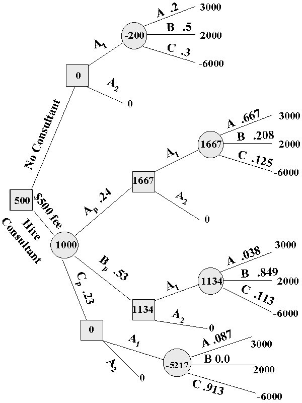
- Input: Preprocessed Data
Output: Model / pola
Menggunakan metode data mining
Mengevaluasi resulting model / pola
Iterasi
Ekperimen dengan menetapkan berbeda beda hyperparameter
Ekperimen dengan beberapa metode lain
Memperbaiki praproses data dan pembangkitan fitur
Meningkatkan jumlah dan kualitas data pelatihan

## Slide 30: Penambangan teks (Text Mining)

**Isi slide:**

- Penambangan teks (Text Mining)
- Penambangan teks (Text mining) (text data mining)
Proses mendapatkan informasi yang berkualitas dari teks
Macam macam tugas text mining
text categorization/classification
text clustering
concept/entity extraction/ topic modelling
sentiment analysis
document summarization
- http://en.wikipedia.org/wiki/Text_mining
