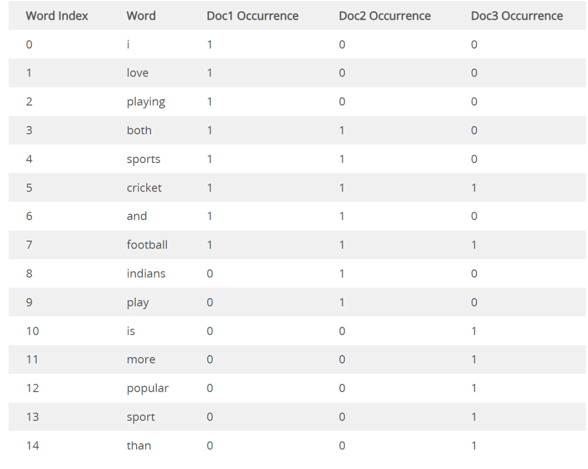
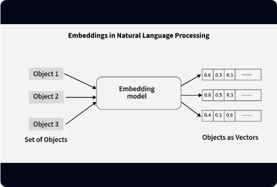
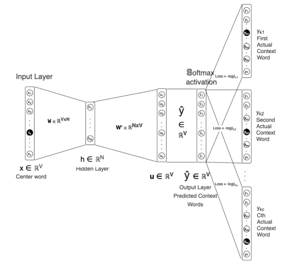
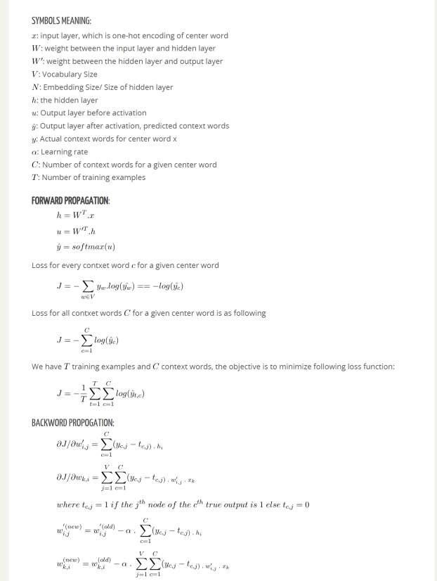
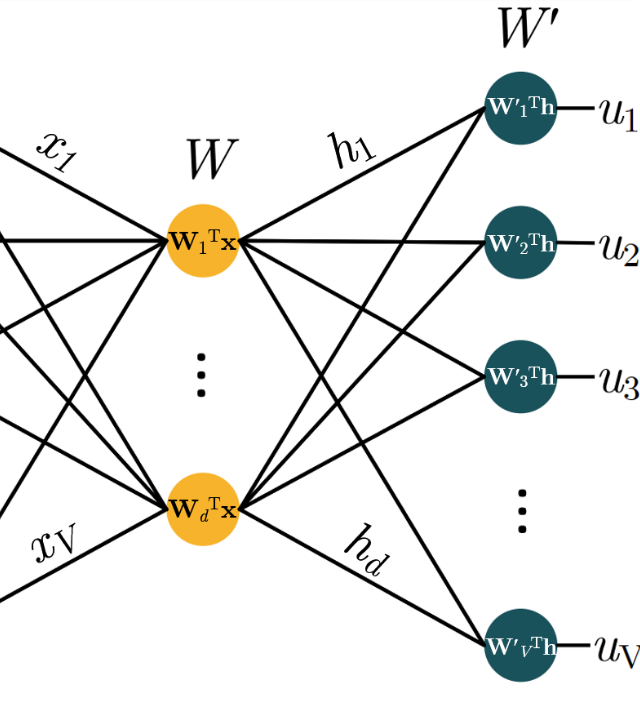
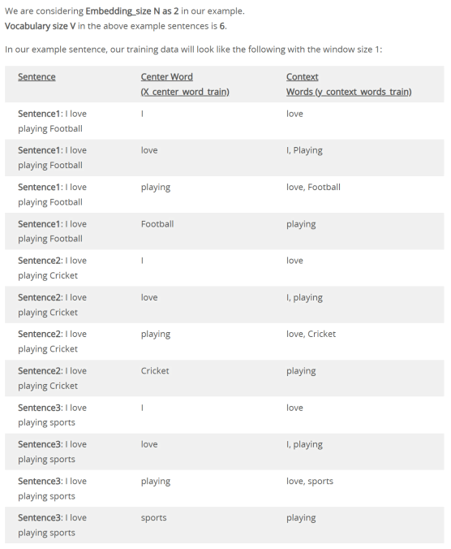
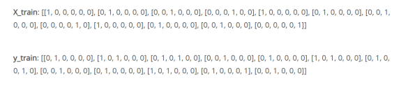
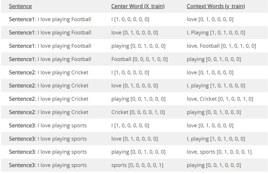
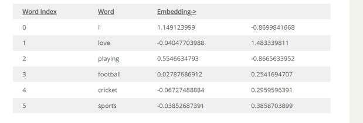

# Representasi Kata dalam NLP — Slide Ringkas

> Dikonversi otomatis dari `lectures/02-Enkoding Kata dalam NLP.pptx`.
> Total 34 slide. Untuk detail aslinya baca file sumber .pptx.

## Slide 1: Representasi Kata dalam NLP

**Isi slide:**

- REPRESENTASI KATA dalam NLP
- Mulaab

## Slide 2: Prinsip Dasar Word Encoding

**Isi slide:**

- Dalam bidang Natural Language Processing (NLP), algoritma AI/ML tidak dapat
  bekerja secara langsung pada data teks mentah. Kunci pemrosesan teks adalah
  mengubah kata menjadi representasi angka yang dapat dipahami oleh mesin.
- Konversi Teks: Mengubah kata-kata menjadi numerik agar dapat dikonsumsi model
  AI.
- Representasi Vektor: Setiap kata diwakili dalam struktur matematis teratur.
- Metode Populer: Label/Integer Encoding dan One-Hot Vector Encoding.

## Slide 3: Apa Itu One-Hot Vector Encoding?

**Isi slide:**

- Konsep Dasar: Metode ini mengonversi satu kata tunggal menjadi vektor
  berdimensi N, di mana N adalah ukuran total kosakata (vocabulary size) dalam
  korpus. Dibutuhkan daya komputasi yang relatif kecil untuk mengonversi data
  teks dan sangat mudah diimplementasikan.
- Struktur Vektor One-Hot: Vektor diisi dengan nilai nol (0) di seluruh
  posisinya, kecuali satu posisi tunggal (hot) bernilai satu (1) yang mewakili
  kata tersebut. Setiap indeks posisi mewakili satu kata unik yang telah
  dipetakan dalam kamus data.

## Slide 4: Contoh 1 — Korpus 6 Kata Unik

**Isi slide:**

- Dokumen Input Korpus:
  - Doc 1: "I love playing football."
  - Doc 2: "Indians love playing Cricket."
- Ukuran Kosakata (N = 6).
- Menyusun representasi word index.

## Slide 5: Contoh 1 — Vektor One-Hot (Dimensi 6)

**Isi slide:**

| Kata Unik | Indeks | Vektor One-Hot (N = 6) | Muncul di |
| --- | --- | --- | --- |
| i | 0 | [1, 0, 0, 0, 0, 0] | Doc 1 |
| love | 1 | [0, 1, 0, 0, 0, 0] | Doc 1 & Doc 2 |
| playing | 2 | [0, 0, 1, 0, 0, 0] | Doc 1 & Doc 2 |
| football | 3 | [0, 0, 0, 1, 0, 0] | Doc 1 |
| indians | 4 | [0, 0, 0, 0, 1, 0] | Doc 2 |
| cricket | 5 | [0, 0, 0, 0, 0, 1] | Doc 2 |

## Slide 6: Contoh 2 — Korpus 21 Kata Unik (3 Dokumen)

**Isi slide:**

- Korpus ini mengekstrak total 21 kata unik (indeks 0 hingga 20).
- Dokumen:
  - Doc 1: "My name is John, What is your name?"
  - Doc 2: "Bill is a very good person. He likes playing soccer."
  - Doc 3: "What is your favorite game? I love Football. Football is a great game."

## Slide 7: Contoh 2 — Representasi Word Index & Vektor

**Isi slide:**

- Representasi Urutan Indeks Kata (Word Index).
- Struktur Vektor One-Hot (Dimensi N = 21).

## Slide 8: Keterbatasan One-Hot Encoding

**Isi slide:**

- Konsumsi Memori Tinggi: Seiring membesarnya ukuran kosakata (ribuan/jutaan
  kata), kebutuhan memori melonjak drastis karena sebagian besar nilai bernilai
  nol (sparse matrix).
- Curse of Dimensionality: Ruang fitur bertambah eksplosif seiring penambahan
  kata baru, membebankan komputasi algoritma pemelajaran mesin (ML).
- Tanpa Informasi Semantik: Setiap kata dianggap ortogonal (berjarak sama). Kata
  berdekatan seperti "football" dan "soccer" tidak memiliki indikator kemiripan
  makna.

## Slide 9: Kapan One-Hot Tetap Dipakai

**Isi slide:**

- Kegunaan Utama: One-Hot Encoding tetap efektif untuk dataset kecil, variabel
  kategorikal, dan model baseline NLP yang sederhana.
- Word Embeddings: Teknik modern seperti Word2Vec & GloVe memetakan kata ke
  dimensi padat (dense) untuk menangkap konteks dan kemiripan semantik.
- Model Transformer: Arsitektur canggih (BERT/GPT) menggunakan representasi
  kontekstual dinamis untuk mengatasi kelemahan enkoding tradisional.

## Slide 10: Model Bag-of-Words (BOW)

**Isi slide:**

- Apa itu BOW? Metode representasi teks paling sederhana dalam NLP yang
  menghitung frekuensi kemunculan setiap kata di dalam dokumen.
- Prinsip Kerja Utamanya:
  - Menerapkan Label / Integer Word Encoding.
  - Mengabaikan tata bahasa (grammar) dan urutan kata.
  - Jumlah frekuensi kata dianggap sebagai bobot (weightage) kata tersebut.
- Penggunaan Utama di Industri:
  - Mesin Pencari (Search): mencocokkan kata kunci pencarian dengan dokumen
    berdasarkan frekuensi kata.
  - Sistem Rekomendasi: merekomendasikan artikel atau produk yang mirip
    berdasarkan kesamaan konten teks.
  - Klasifikasi Teks: sebagai input ekstraksi fitur awal untuk model ML (spam
    detection, analisis sentimen).

## Slide 11: Contoh 1 — Vektor BOW Sederhana (2 Dokumen)

**Isi slide:**

- Korpus (N = 2): Doc 1 "I love playing football." ; Doc 2 "Indians love
  playing Cricket."
- Kamus Kosakata (6 Kata Unik): indeks 0: 'i', 1: 'love', 2: 'playing',
  3: 'football', 4: 'indians', 5: 'cricket'.
- Hasil Vektor BOW (Panjang Vektor = 6):
  - BOW Doc 1: [1, 1, 1, 1, 0, 0] → 'i', 'love', 'playing', 'football' muncul
    masing-masing sekali.
  - BOW Doc 2: [0, 1, 1, 0, 1, 1] → 'love', 'playing', 'indians', 'cricket'
    muncul masing-masing sekali.

## Slide 12: Contoh 2 — Vektor BOW pada Korpus Lebih Besar

**Isi slide:**

- Kamus Kosakata (21 Kata Unik / Indeks 0 s.d. 20):
  {0: 'my', 1: 'name', 2: 'is', 3: 'john', 4: 'what', 5: 'your', 6: 'bill',
  7: 'a', 8: 'very', 9: 'good', 10: 'person', 11: 'he', 12: 'likes',
  13: 'playing', 14: 'soccer', 15: 'favorite', 16: 'game', 17: 'i',
  18: 'love', 19: 'football', 20: 'great'}
- Vektor Frekuensi BOW (Ukuran Vektor = 21):
  - BOW Doc 1: [1, 2, 2, 1, 1, 1, 0, 0, 0, 0, 0, 0, 0, 0, 0, 0, 0, 0, 0, 0, 0]
    → 'name':2, 'is':2, dst.
  - BOW Doc 2: [0, 0, 1, 0, 0, 0, 1, 1, 1, 1, 1, 1, 1, 1, 1, 0, 0, 0, 0, 0, 0]
    → 'is':1, 'bill':1, dst.
  - BOW Doc 3: [0, 0, 2, 0, 1, 1, 0, 1, 0, 0, 0, 0, 0, 0, 0, 1, 2, 1, 1, 2, 1]
    → 'is':2, 'game':2, 'football':2, dst.

## Slide 13: Keterbatasan Utama Bag-of-Words

**Isi slide:**

- Kehilangan Urutan Kata: Urutan kata dan konteks kalimat diabaikan sepenuhnya
  ('not good' dianggap sama dengan 'good').
- Dominasi Kata Umum: Kata-kata umum yang muncul sangat sering (seperti 'is',
  'a', 'the') mendapat bobot paling tinggi padahal kurang informatif.
- Sparsity (Matriks Jarang): Jika jumlah dokumen & kosakata besar, mayoritas
  elemen matriks bernilai 0 sehingga boros memori.
- Masalah OOV (Out of Vocabulary): Tidak dapat mengenali kata baru yang tidak
  ada pada saat pembuatan kamus kosakata.
- Solusi & Evolusi Model NLP:
  - TF-IDF: memperbaiki BOW dengan memberikan penalti/diskon pada kata-kata
    umum yang sering muncul di banyak dokumen.
  - N-Gram (Bi-gram, Tri-gram): menggabungkan N kata berurutan untuk
    mempertahankan sebagian konteks lokal.
  - Word Embeddings (Word2Vec, GloVe): representasi vektor padat (dense) yang
    mampu menangkap kemiripan makna/semantik antar kata.
  - Transformers (BERT, GPT): model modern berbasis perhatian (attention) yang
    memahami konteks secara penuh dalam kalimat.

## Slide 14: TF-IDF

**Isi slide:**

- Apa itu TF-IDF? Term Frequency - Inverse Document Frequency adalah metode
  pembobotan teks populer dalam NLP untuk Mesin Pencari, Sistem Rekomendasi,
  dan Klasifikasi Teks.
- Mengapa Dibuat: BOW memiliki kelemahan pembobotan yang didominasi kata-kata
  umum (seperti 'is', 'the', 'a', 'dan') yang sering muncul tetapi tidak membawa
  informasi spesifik.
- Prinsip Kerja Utama:
  - Pentingnya Kata: memberikan bobot tinggi jika kata muncul berkali-kali
    dalam dokumen tertentu.
  - Penalti Kata Umum: mengurangi bobot secara drastis jika kata muncul terlalu
    sering di banyak dokumen.
- Penggunaan Utama di Industri: mesin pencari (pemeringkatan dokumen), sistem
  rekomendasi (pencocokan artikel), klasifikasi teks (ekstraksi fitur untuk
  model ML).

## Slide 15: Formulasi Matematika TF-IDF

**Isi slide:**

- tf_idf(t, d, D) = tf(t, d) × idf(t, D)
- Term Frequency (tf): tf(t, d) = jumlah t dalam d. Meningkat secara
  proporsional seiring makin seringnya kata muncul di dalam dokumen tersebut.
- Inverse Document Frequency (idf): idf(t) = log(N / df(t)). Nilainya menurun
  seiring meningkatnya jumlah dokumen yang memuat kata tersebut di seluruh
  korpus.
- Glosarium Variabel:
  - tf: frekuensi kata/istilah dalam dokumen spesifik
  - idf: kebalikan frekuensi dokumen dalam korpus
  - t: istilah/kata (term)
  - d: dokumen spesifik
  - D: seluruh koleksi dokumen (korpus)
  - N: jumlah total dokumen di dalam korpus
  - df(t): jumlah dokumen yang mengandung kata t

## Slide 16: Contoh 1 — Persiapan Korpus & Vektor TF

**Isi slide:**

- Kamus/Vocab (6 Kata Unik): indeks 0: 'i', 1: 'love', 2: 'playing',
  3: 'football', 4: 'indians', 5: 'cricket'.
- Matriks Term Frequency (tf) — vektor frekuensi kata seperti Bag of Words:
  - Doc 1: [1, 1, 1, 1, 0, 0] → 'i':1, 'love':1, 'playing':1, 'football':1
  - Doc 2: [0, 1, 1, 0, 1, 1] → 'love':1, 'playing':1, 'indians':1, 'cricket':1

## Slide 17: Contoh 1 — Perhitungan IDF & Bobot TF-IDF

**Isi slide:**

- Perhitungan IDF: log(N / df)
  - idf('i') [df=1] = log(2/1) = 0.6931
  - idf('love') [df=2] = log(2/2) = 0.0000 (penalti!)
  - idf('playing') [df=2] = log(2/2) = 0.0000 (penalti!)
  - idf('football') [df=1] = log(2/1) = 0.6931
  - idf('indians') [df=1] = log(2/1) = 0.6931
  - idf('cricket') [df=1] = log(2/1) = 0.6931
- Matriks Bobot Akhir TF-IDF (tf × idf):
  - Doc 1: [0.693, 0.000, 0.000, 0.693, 0.000, 0.000]
  - Doc 2: [0.000, 0.000, 0.000, 0.000, 0.693, 0.693]
- Insight Kunci: Kata 'love' dan 'playing' berbobot 0.000 karena muncul di
  semua dokumen. TF-IDF berhasil meredam kata umum dan menyoroti kata kunci
  spesifik seperti 'football' dan 'cricket'.

## Slide 18: Keunggulan & Keterbatasan TF-IDF

**Isi slide:**

- Keunggulan Utama:
  - Eliminasi Kata Umum Otomatis: meredam stop words tanpa pembersihan manual.
  - Menyoroti Kata Kunci: skor tinggi untuk kata yang unik dan mencirikan
    dokumen.
  - Efisien & Sederhana: cepat dihitung secara komputasi.
  - Bagus sebagai Baseline: sangat cocok untuk model awal klasifikasi teks.
- Keterbatasan & Solusi Modern:
  - Agnostik Konteks: tidak memperhitungkan urutan kata atau makna semantik.
  - Sparse Matrix: didominasi nilai nol jika kosakata sangat besar.
  - Masalah OOV: tidak bisa menangani kata baru di luar data latih.
- Solusi Modern NLP: evolusi berlanjut ke Word Embeddings (Word2Vec, GloVe) dan
  Transformer (BERT, GPT) yang mampu memahami konteks dan makna kata.

## Slide 19: SVD Based Word Embedding

**Isi slide:**

- Mengapa Membutuhkan Word Embedding?
  - Tanpa Hubungan Semantik: Integer/One-Hot Encoding tidak dapat mendeteksi
    bahwa kata 'Soccer' dan 'Football' memiliki makna serupa.
  - Curse of Dimensionality: ukuran matriks One-Hot membengkak seiring
    bertambahnya kosakata.
  - Bias Tak Diinginkan: Integer Label Encoding memberikan bobot urutan numerik
    acak yang salah diartikan oleh model.
- Solusi: Representasi Vector Embedding — representasi kata dalam ruang vektor
  berdimensi tetap (misal: N = 100 hingga 300) yang independen dari ukuran total
  kosakata.

## Slide 20: Metodologi SVD — Document-Term Matrix & Reduksi Dimensi

**Isi slide:**

- Dua Metode Utama Generasi Embedding:
  1. Berbasis SVD (Matrix Factorization): membuat matriks ko-okurensi
     (Co-occurrence Matrix) terlebih dahulu, lalu mereduksi dimensinya
     menggunakan Singular Value Decomposition (SVD).
  2. Berbasis Neural Network/Iterasi: mempelajari vektor kata secara langsung
     dengan memprediksi kata sekitar melalui model iteratif (misal: Word2Vec
     CBOW & Skip-Gram).
- Dua Cara Membuat Matriks Ko-Okurensi SVD: Document-Term Matrix (DTM) dan
  Window-based Co-Occurrence Matrix.
- Konsep Document-Term Matrix (DTM):
  - Pembentukan Matriks Awal: menghitung frekuensi kemunculan setiap kata di
    setiap dokumen, menghasilkan matriks berukuran (N × D) di mana N = Jumlah
    Kosakata, D = Jumlah Dokumen.
  - Menerapkan SVD: matriks (N × D) ditransformasikan & direduksi menjadi
    matriks (N × d), dengan d = dimensi embedding yang diinginkan (misal d = 2
    atau 100 s.d. 500).
  - Hasil Vektor Kata: setiap baris pada matriks hasil SVD menjadi embedding
    berdimensi-d untuk kata bersangkutan.

## Slide 21: Studi Kasus — Transformasi DTM ke Embedding 2D via SVD

**Isi slide:**

- Korpus (N = 15 kata unik, D = 3 dokumen):
  - Doc 1: "I love playing both sports, Cricket and Football"
  - Doc 2: "Indians play both sports, Cricket and Football"
  - Doc 3: "Football is more popular sport than Cricket"

| Indeks | Word | Dim 1 | Dim 2 |
| --- | --- | --- | --- |
| 0 | i | 0.6801 | -0.3136 |
| 1 | love | 0.6801 | -0.3136 |
| 2 | playing | 0.6801 | -0.3136 |
| 3 | both | 1.3022 | -0.5450 |
| 4 | sports | 1.3022 | -0.5450 |
| 5 | cricket | 1.6901 | 0.3759 |
| 6 | and | 1.3022 | -0.5450 |
| 7 | football | 1.6901 | 0.3759 |
| 8 | indians | 0.6221 | -0.2314 |
| 9 | play | 0.6221 | -0.2314 |
| 10 | is | 0.3879 | 0.9209 |
| 11 | more | 0.3879 | 0.9209 |
| 12 | popular | 0.3879 | 0.9209 |
| 13 | sport | 0.3879 | 0.9209 |
| 14 | than | 0.3879 | 0.9209 |

## Slide 22: Masalah One-Hot Encoding

**Isi slide:**

- Tidak Ada Hubungan Semantik: metode tradisional tidak dapat menangkap
  kemiripan makna antar kata. Kata seperti "Sepak Bola" dan "Futsal"
  diperlakukan sebagai entitas terpisah yang sepenuhnya independen (ortogonal).
- Ledakan Dimensi (Curse of Dimensionality): pada One-Hot Encoding, ukuran
  vektor bertambah seiring membesarnya kosakata. Untuk 1 juta kata, setiap kata
  membutuhkan vektor berukuran 1 juta elemen, sangat tidak efisien dalam memori.

## Slide 23: Apa Itu Word Embeddings?

**Isi slide:**

- Word Embeddings adalah teknik pemetaan kata tunggal ke dalam vektor berdimensi
  rendah bernilai riil (biasanya 50 hingga 300 dimensi).
- Dimensi Tetap: ukuran vektor independen dari total jumlah kosakata dalam
  korpus.
- Jarak Vektor Semantik: kemiripan kata diukur langsung melalui jarak spasial
  (misal: Cosine Similarity).
- Mengatasi High-Dimensionality: memangkas matriks jarang (sparse) menjadi
  matriks padat (dense).

## Slide 24: Intuisi Utama Word Embeddings

**Isi slide:**

- "You shall know a word by the company it keeps." — J. R. Firth (1957)
- Makna sebuah kata ditentukan oleh kata-kata tetangga yang sering muncul di
  sekitarnya dalam korpus teks.

## Slide 25: Metodologi Generasi Embedding

**Isi slide:**

- Metode Berbasis SVD: menggunakan faktorisasi matriks Singular Value
  Decomposition (SVD) pada matriks kemunculan bersama (Co-occurrence Matrix)
  untuk reduksi dimensi.
- Metode Berbasis Neural Network: menggunakan model iteratif seperti Word2Vec
  (CBOW & Skip-Gram) untuk memprediksi kata tetangga secara langsung dari korpus
  besar.

## Slide 26: Keterbatasan Metode Berbasis SVD

**Isi slide:**

- Ketidakseimbangan Matriks: kata-kata berfrekuensi tinggi (seperti "dan",
  "yang") mendominasi matriks, menyebabkan skewness data yang parah.
- Biaya Komputasi Tinggi: kompleksitas perhitungan SVD sangat mahal (bergantung
  pada ukuran kosakata m dan dimensi embedding n).
- Sulit Diperbarui: ketika ada kata atau dokumen baru ditambahkan, seluruh
  matriks harus dihitung ulang dari awal.

## Slide 27: Skip-Gram

**Isi slide:**

- Skip-Gram (judul bagian).

## Slide 28: Pelatihan Model Word Embedding Skip-Gram

**Isi slide:**

- Pelatihan Model Word Embedding Skip-Gram (diagram pada slide asli).

## Slide 29: Parameter & Data Pelatihan

**Isi slide:**

- Parameter utama: ukuran embedding, ukuran kosakata, ukuran jendela (window
  size) = 1.
- Kalimat sampel:
  - "I love playing Football"
  - "I love playing Cricket"
  - "I love playing sports"
- Pembentukan data: memetakan setiap kata pusat (center word) dengan kata
  konteks (context word) di sekitarnya berdasarkan ukuran jendela 1.

## Slide 30: Arsitektur Jaringan Saraf

**Isi slide:**

- Tujuan Model: memprediksi kata konteks berdasarkan kata pusat yang diberikan.
- Dimensi Lapisan Bobot: lapisan pertama dan lapisan kedua (jumlah unit pada
  slide asli).
- Prediksi & Output: lapisan akhir menggunakan fungsi aktivasi softmax untuk
  menghasilkan prediksi kata konteks.
- Hasil Akhir: setiap baris bobot pada lapisan pertama menjadi embedding bagi
  kata yang sesuai setelah pelatihan selesai.

## Slide 31: Pengodean Kosakata & Vektor Pelatihan

**Isi slide:**

- Indeks Kosakata: daftar unik token beserta nilai indeksnya (Ukuran Kosakata).

| Indeks | Kata (Token) |
| --- | --- |
| 0 | 'I' |
| 1 | 'love' |
| 2 | 'playing' |
| 3 | 'football' |
| 4 | 'cricket' |
| 5 | 'sports' |

- Pengodean Data Pelatihan: transformasi teks menjadi format numerik untuk
  proses komputasi machine learning.
  - X_train: representasi vektor one-hot untuk kata pusat.
  - y_train: representasi vektor target (one-hot) untuk kata konteks.

## Slide 32: Contoh Pengodean Data Pelatihan

**Isi slide:**

- Contoh dokumen pelatihan beserta kalimat dan tabel pengodeannya.

## Slide 33: Skip-Gram

**Isi slide:**

- Skip-Gram (bagian penutup / ringkasan).
- Diagram arsitektur sama dengan Slide 27 (dirujuk sekali di sana).

## Slide 34: Notasi Pelatihan Skip-Gram

**Isi slide:**

- Notasi matematika pada pelatihan model Skip-Gram.

